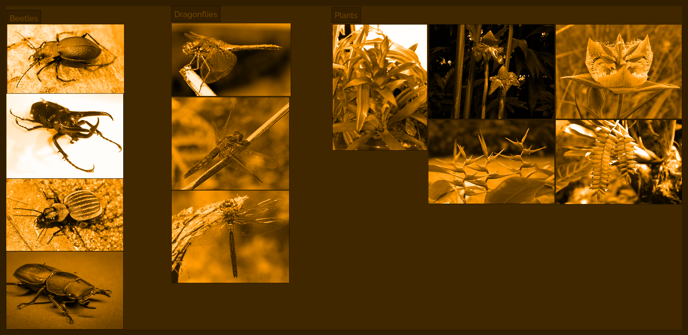
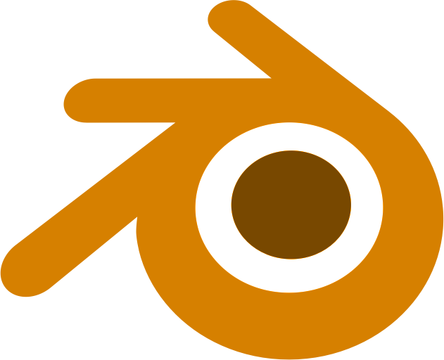
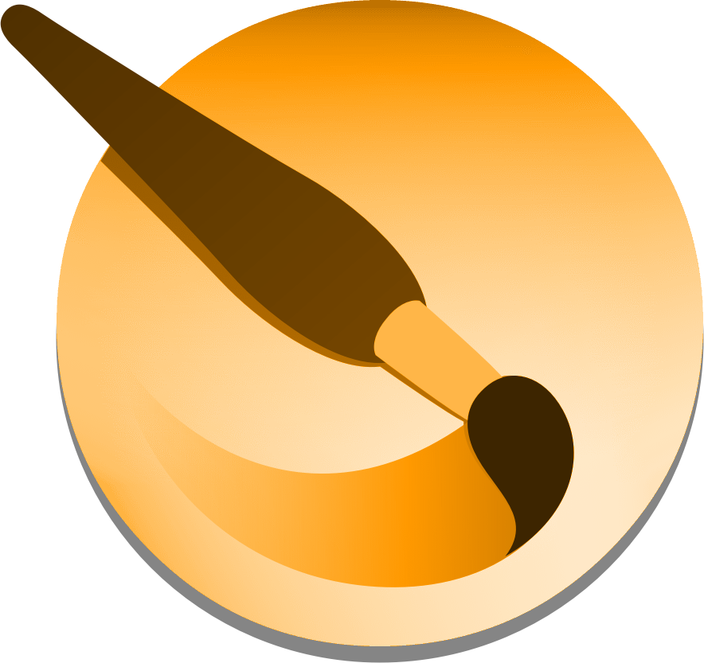

# Disclaimer

I’m a self-taught digital art student. I wouldn’t call myself an artist.

My academic background is in physics and IT. I’m currently working as a freelance programmer and do digital art on the side as a hobby.

I’ve been doing digital art on-and-off for about five years at the point of this writing. But I haven’t been consistent with it and haven’t gone beyond an average level of appeal with my designs and paintings.

I created this document to improve my digital art skills faster by following a structured approach and teaching some of the techniques used in draftsmanship and painting along the way.

Within it, you find general drawing and painting techniques taught in many other places and, hopefully, a showcase on applying them to drive self-improvement.

We’re in the context of a Romanian Discord server - Brainwash, making up a small community of 2D and 3D designers. We came up with this structured learning approach within this server by taking inspiration from other free online learning resources.

The approach discussed here works best within a community because it relies on active feedback and constructive criticism.

|||
|:--|--:|
|<a href="//linktr.ee/razcore.rad">Răzvan C. Rădulescu AKA razcore-rad</a>|<svg title="linktree logo icon" width="24" height="24" viewBox="0 0 24 24" fill="none" xmlns="http://www.w3.org/2000/svg"><g clip-path="url(#clip0_707_64680)"><path d="M13.5108 5.85343L17.5158 1.73642L19.8404 4.11701L15.6393 8.12199H21.5488V11.4268H15.6113L19.8404 15.5345L17.5158 17.8684L11.7744 12.099L6.03299 17.8684L3.70842 15.5438L7.93745 11.4361H2V8.12199H7.90944L3.70842 4.11701L6.03299 1.73642L10.038 5.85343V0H13.5108V5.85343ZM10.038 16.16H13.5108V24.0019H10.038V16.16Z" fill="white"></path></g><defs><clipPath id="clip0_707_64680"><rect width="24" height="24" fill="white"></rect></clipPath></defs></svg>|

# About

What is "Artistic Design Mastery from a Hobbyist"? Referred to as **ADeM** from now on.

It’s a "live" document that serves two purposes:

1. First, it compiles a list of useful short **snippets** for explaining particular **drawing** and **painting** techniques.
2. Second, it’s an evolving showcase of how to achieve design mastery through building a sizable visual library covering many topics that fall broadly under these categories: **organic**, **hard-surface**, and **figure**.

The organic category includes anything that generally has rounder or bendy forms. This includes insects, arachnids, fish, small birds and animals, plants, natural rock formations, and other man-made objects such as accessories, flour sacks, backpacks, etc.

Hard-surface includes mainly man-made structures and objects such as everyday items including cars, boats, airplanes, tanks, furniture. Futuristic devices, MECHs, and more also fall under this category.

Lastly, the figure category refers mainly to the human figure, but we include large animals with more complex anatomy.

We use a two-week cycle that keeps things exciting and diverse while covering a broad range of topics as we develop our drawing and painting techniques.

We divide the **first week** into three phases:

1. **First, we understand** the subject matter from the given reference images using the draw-through method to decipher how the volumes relate to each other in 3D space.
1. **In the second part, we master** the subject by doing refined drawings **using more precise 3D forms**. After learning the forms, **we texture them** following the reference images. **We end this part with complete textured illustrations**.
1. **We solidify our visual library by combining the given references to design an imagined object or creature**. Students can challenge themselves by creating extra designs with elements not covered by the provided reference images.

In the **second week**, we build on top of the previous one by painting our designs. Therefore, we divide this week into two phases:

1. **We start with material studies** using the same references from the first week. It helps us understand how light interacts with the subject matter that we designed in the previous week.
1. **In the second phase, we paint the designs under different light conditions** to solidify how everything is tied in together.

While attending the program, students are encouraged to give the other participants constructive feedback as much as possible.

## Software

We use [PureRef](https://www.pureref.com/), a free image reference software, for distributing reference image sets from online resources.

**Verify their LICENSE agreements if you want to use them for your professional work.**

Other than PureRef, there’s no requirement for the software you want to sketch with. Or, if you prefer, you can do the exercises traditionally.

To download the PureRef file, click on the image preview for that week:

[Blender](https://www.blender.org/) is a free 3D software that can help us understand how forms turn in space and perspective while being affected by different lenses covering orthographic, one, two, three-point-perspective, and even fisheye.

I suggest using it from time to time by building rough 3D models of your complex designs to build an intuition for how everything fits together.

This isn’t mandatory, but I think it dramatically improves our learning process.

For completeness sake, I’ll mention that I’m using [Krita](https://krita.org/en/), a free painting software. I made my own brushes, which are part of [my larger package set](https://github.com/razcore-code/krita-resources) available for free.

I prefer a traditional look even though I work digitally.

{{#include footer.md}}

