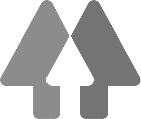

# Disclaimer

I’m a self-taught digital art student. I wouldn’t call myself an artist.

My academic background is in physics and IT. I’m currently working as a freelance programmer and do digital art on the side as a hobby.

I’ve been doing digital art on-and-off for about five years at the point of this writing. But I haven’t been consistent with it and haven’t gone beyond an average level of appeal with my designs and paintings.

I created this document to improve my digital art skills faster by following a structured approach and teaching some of the techniques used in draftsmanship and painting along the way.

Within it, you find general drawing and painting techniques taught in many other places and, hopefully, a showcase on applying them to drive self-improvement.

**We’re in the context of a Romanian Discord server - Brainwash, making up a small community of 2D and 3D designers. We came up with this structured learning approach within this server by taking inspiration from other free online learning resources.**

The approach discussed here works best within a community because it relies on active feedback and constructive criticism.

<table style="width: 100%">
  <tr>
    <td>Răzvan Cosmin Rădulescu AKA razcore-rad</td>
    <td style="text-align: right">
      
    </td>
  </tr>
</table>

Copyright ©2021 Răzvan Cosmin Rădulescu AKA razcore-rad

