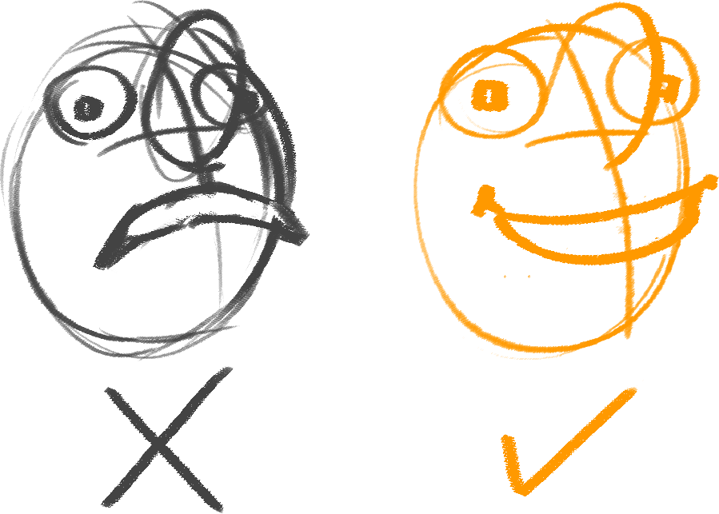
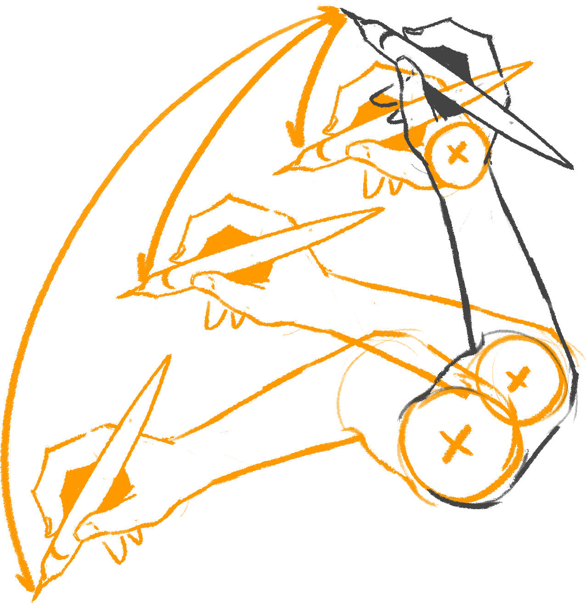

# Design Tidbitsi > Line > Confident

Use a hard brush with little to no opacity. For example, I’m using a brush with this form:

I use 100% opacity and an exponential curve for the flow setting. So it has a very faint degree of transparency but quickly becomes opaque with very little pressure on the stylus.

At first, you’ll be tempted to erase and skip the draw-through method. However, it’s in your interest to incorporate this method into your practice.

**Avoid scratchy lines and drawing many times over the same place. Force yourself to avoid erasing as much as possible!**

## Technique

When it comes to precision, it’s essential to know when to use your wrist, elbow, and shoulder to generate the most efficient stroke.

We develop a feeling for as long as we’re conscious of our strokes when practicing and correcting if needed.

It’s not a matter of one being better than the other.

For example, it makes no sense to use your shoulder to draw a tiny circle. That’s when you use the wrist.

**Pick and choose the best tool for the job you need to do.**

Copyright ©2021 Răzvan Cosmin Rădulescu AKA razcore-rad

