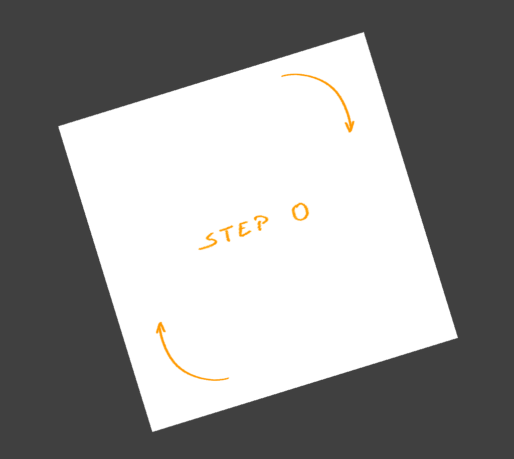
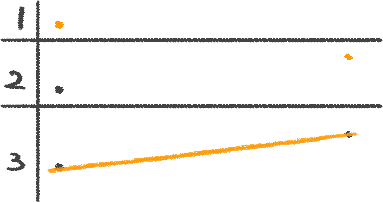
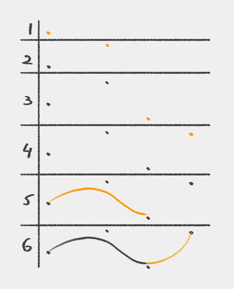
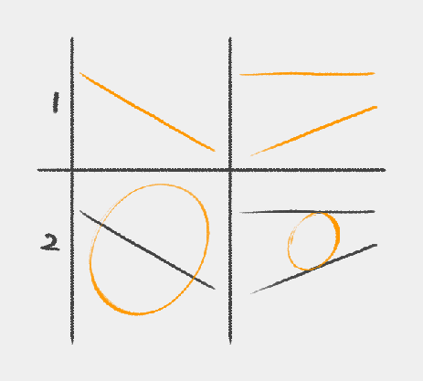
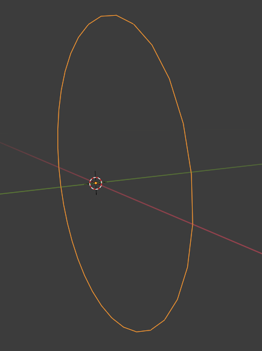
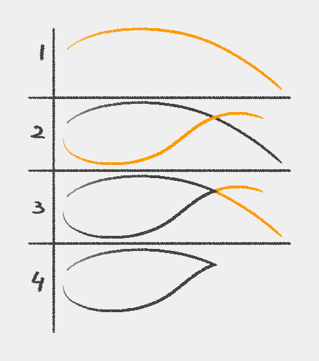

# Design Tidbits > Line > Clean

Confidence and getting a clean look are sides of the same coin. They both contribute to an appealing design that looks skillfully executed.

Get clean drawings by first aligning your canvas with your natural hand position.

## Lines

For lines, follow these steps with your canvas zoomed out to have a shorter distance to traverse.

**Don’t go too much beyond the reference points!**

These can also be imaginary points that naturally appear in your drawing as you advance the design.

It makes sense to plot the reference points only if you’re unsure if the drawing is enough.

## Curves

For curves, we use the same approach as we did for the line.

**Don’t stress about making the motion in one continuous shot!** Instead, we can combine multiple strokes as long as we build that confidence! See the [previous section](./04-design-tidbits-01-line-01-confident.html).

We don’t necessarily try touching every single guiding point other than the ends.

#### Ellipses

For ellipses and circles, find guides in your drawing or add them yourself to align them properly in space.

**Don’t draw more than one or two revolutions!**

These guides converge to vanishing points on the horizon line.

When doing freehand drawings, it’s challenging to get the tilt of the circle right. Unfortunately, there isn’t a simple method that we can use to “get things right”.

We need to practice wisely.

To that end, in the following image, I set Blender with a 20-degree field of view to accentuate how our intuition might be wrong about the **circle**’s center in perspective.

It’s notoriously difficult for beginners to get the shape of the ellipse correct. However, we can use 3D software to gain an intuition about all of this and more.

I encourage you to use 3D software when you don’t know how things align in 3D space.

**The ellipse is cut perfectly in half by the green (Y) perpendicular perspective line. This is because it acts as the minor ellipse axis.**

When you first start, it’s difficult, so don’t be hard on yourself. It takes lots of patience and practice!

#### Overshoot

How to get clean lines?

An easy method is to overshoot past your lines, but on separate layers, and once done cleaning up, we can safely merge the layers.

Rinse and repeat as many times as necessary. Using shortcuts can be a swift process, and with enough practice, it can become your second nature.

{{#include footer.md}}

