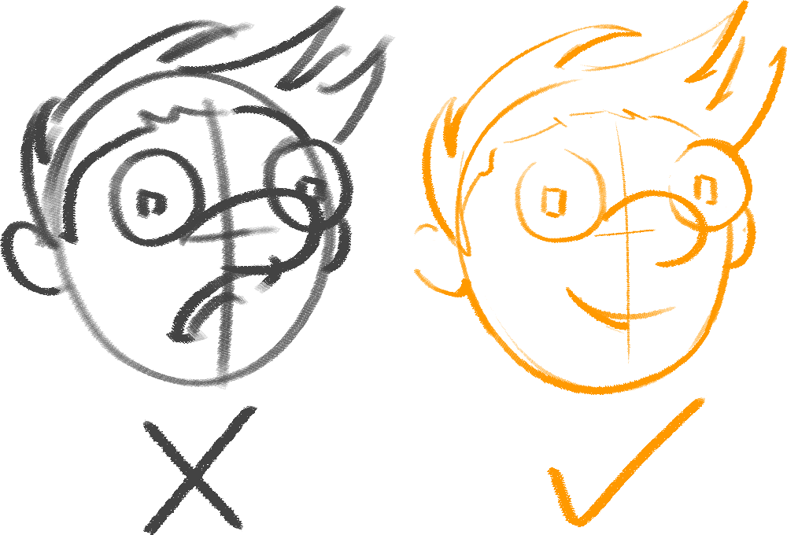
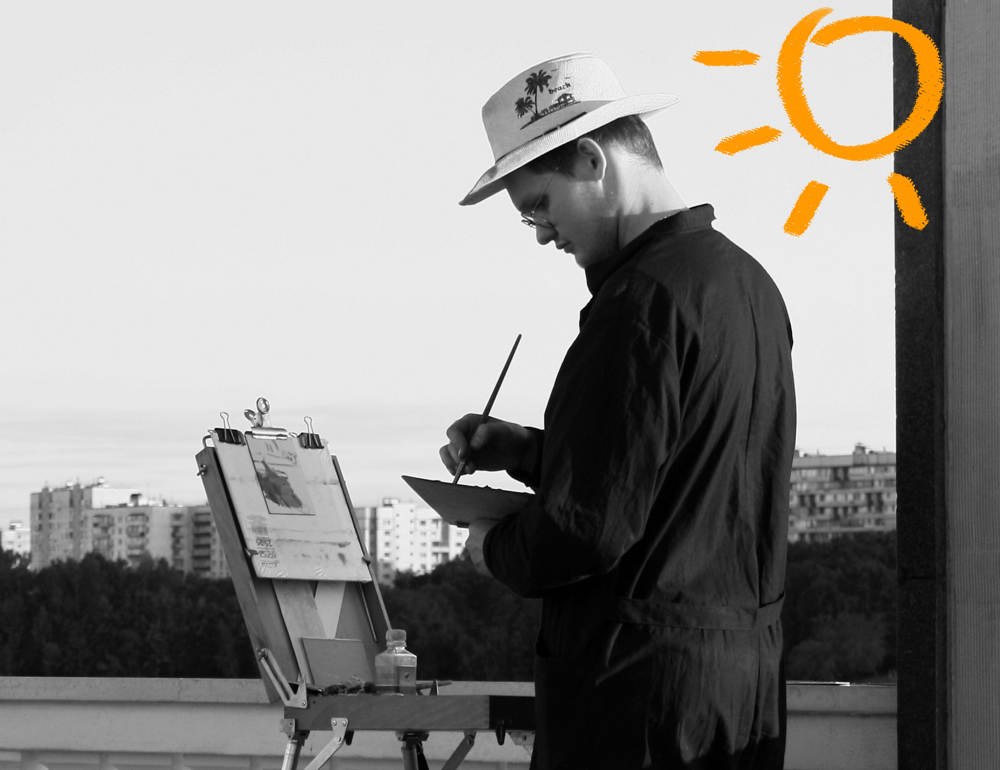
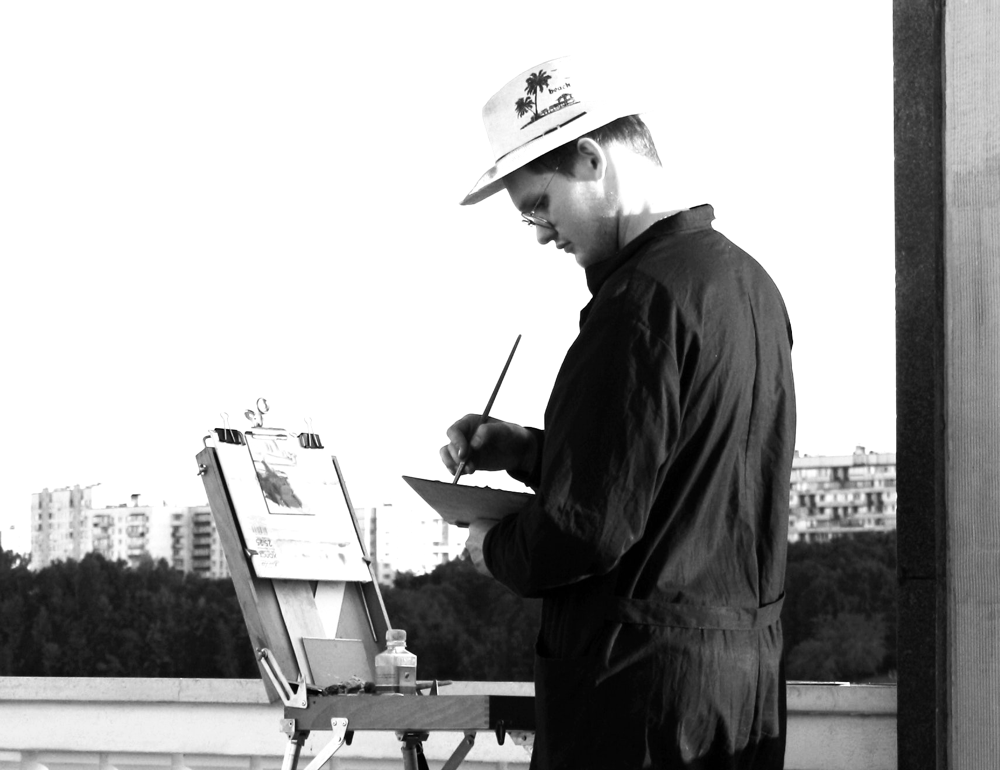
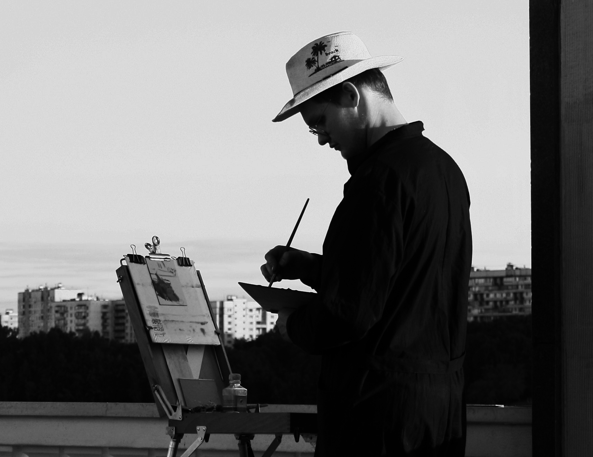
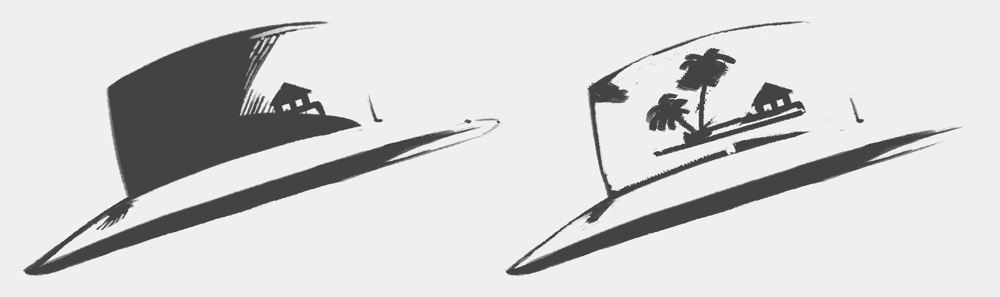
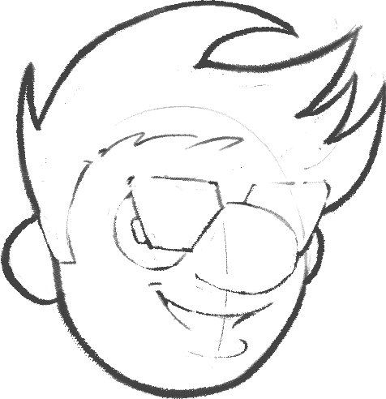
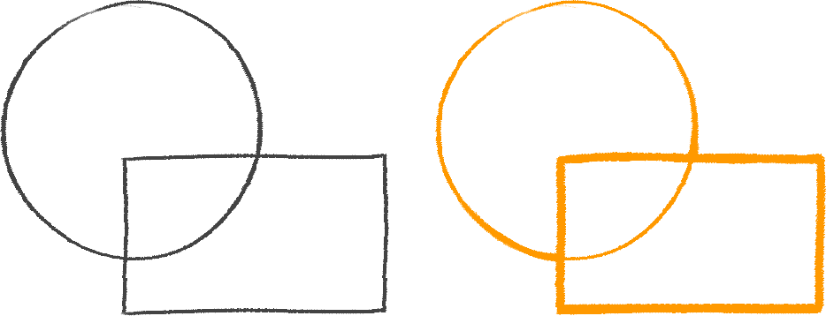
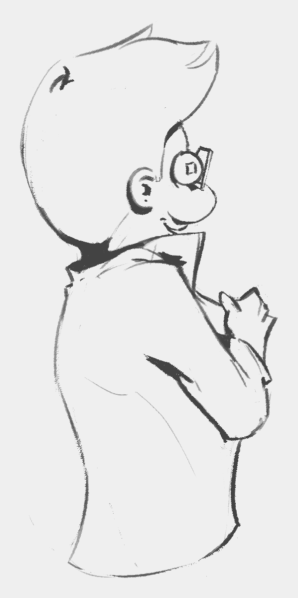

# Design Tidbits > Line > Weight

To get a professional look, we emphasize some lines but not others.

## Where and why?

How do we know which lines to thicken?

Let’s turn to real life for an explanation.

| Original | Adjusted - Bright | Adjusted - Dark |
| --- | --- | --- |
|  |  |  |

  Photo by <a href="https://www.pexels.com/@alex-kozlov-3442124?utm_content=attributionCopyText&utm_medium=referral&utm_source=pexels">Alex Kozlov</a> from <a href="https://www.pexels.com/photo/city-man-people-woman-8402317/?utm_content=attributionCopyText&utm_medium=referral&utm_source=pexels">Pexels</a>

As design students, we need to be critical about capturing our subject once we establish the light direction.

When drawing, we can play with the contrast and brightness by choosing what to detail and simplify, just like playing with photo parameters.

**Direct light** washes the information while **shadow** hides it. Regardless, the outcome is the same from a drawing perspective - we can omit to detail entire portions by joining them together either in light or dark.

This is an opportunity for us to design appealing shapes.

At the transition between direct light and shadow, we have information that translates into a rich texture.

**Our job as artistic design students is to figure out the essence of a design. Then, we can emphasize it by establishing an appealing transition between direct light and shadow.**

Light scenarios can be either informed by references or entirely constructed by design.

## Line drawings

How do we apply this concept to line drawings?

Pick a **light source** and let that inform your decisions of where to **thicken the lines**. Simple as that.

OK, maybe it’s not THAT simple. But, this is just one way of doing it.

There may be style choices that build on top of light direction or overwrite it entirely.

**Line weight** is also perfect for making **overlapping shapes** stand out.

The rectangle looks closer to us than the circle in the right picture because of how we used line weight.

## Ambient occlusion

Another method to enrich the drawings is to thicken the lines where we have ambient occlusion (AO).

When discussing drawing and painting, ambient occlusion refers to areas where light can’t reach, like crevices.

Can you spot the places where I emphasized the AO?

The term ambient occlusion comes from computer graphics.

## Design for animation

I just wanted to mention that designing for animation is usually very different. They don’t care about the fancy line weights. They’re interested in clean same-thickness lines because they have to keep the drawings consistent across frames.

Copyright ©2021 Răzvan Cosmin Rădulescu AKA razcore-rad

