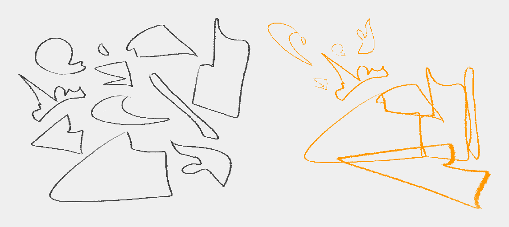
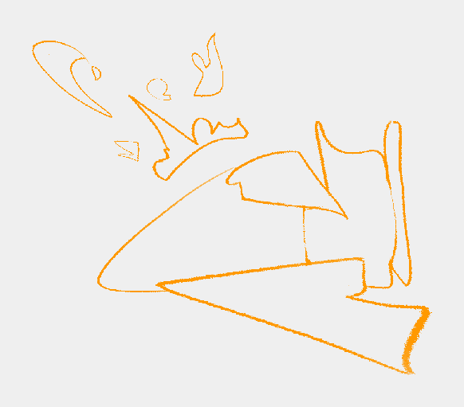

# Design Tidbits > Line > Shapes

What do we mean when we say appealing shapes?

Our **brains are pattern-seeking machines**, and we can use this to our advantage when designing.

**The appeal doesn’t reside in shapes themselves. Instead, it arises in the distribution of many shapes that create illusions of patterns.**

There’s a reason why it’s shape**S** and **not** shape!

To exemplify, I made a bunch of seemingly random shapes (left). I didn’t think of anything specific. I just made some scribbles and barely refined them.

I took the shapes and organized them into a “composition” (right).

The point here isn’t to make something look nice but to show how just by **placing shapes deliberately, our brain interprets them as meaningful patterns. It creates stories for us that fill in the blanks.**

It’s just like cloud-gazing.

The next step is to clean up the interior of the silhouette and apply some of the other techniques.

In the following image, I barely cleaned the interior, and it already looks much better. I didn’t even touch the non-overlapping shapes to the top-left.

An exception to this explanation is that our brains can interpret secondary forms at the border as distinct shapes when designing large areas. But then, **it’s the distribution of those secondary forms that our brain recognizes as meaningful patterns**.

Ultimately, **this is a balancing act between chaos and deliberate placement**. Too much in one direction, and we break the illusion.

Copyright ©2021 Răzvan Cosmin Rădulescu AKA razcore-rad

