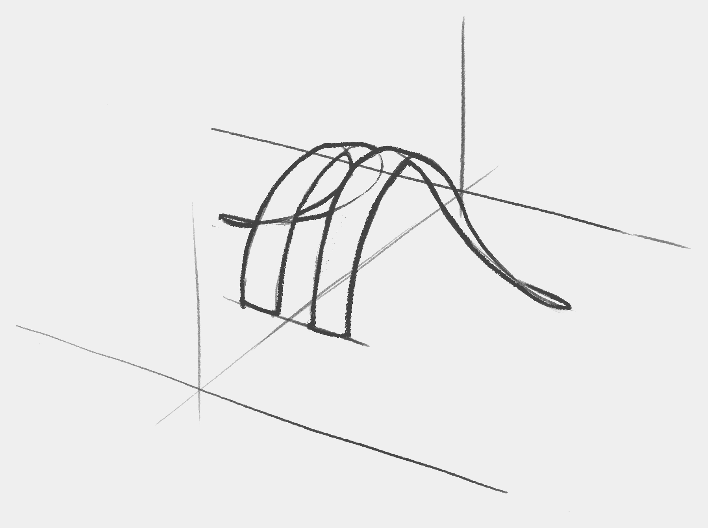

# Demo > Organic > Wk.01

## 1. Understand

Pick a few reference images from each provided subject matter and decipher them with the help of **logical basic 3D forms**.

You don’t have to break each element into one continuous segment. For example, we can use 4 segments for the tail to better understand how it twists and turns.

Ideally you want to do it without tracing, but at this point, especially if you have a hard time understanding the forms, tracing is fine, but try not to rely too much on it.

Next, you’re going to pose your reference in perspective from different angles using the basic forms you used. **I’m showing one view here, do at least two for each reference!**

**Draw through the obstructed parts! Reproduce a mannequin that feels 3D. Go for a clean and confident look and try not to erase as much.**

### Exceptions

In some cases the subject can vary a lot, for example, the horns. In this case do a **breakdown for three-to-five of them**.

When dealing with organic shapes that twist and turn wildly, it’s best to draw through the form following the twist and connecting the curves where the shape closes off:

**Use line weight to emphasise which curves are in front and which in the back!**

Pick one that you like, and draw the subject from **two different perspectives**. Here I demonstrate from one:

### Recap

If **the subject matter is fairly consistent**, like in the case of the komodo dragon:

1. Break reference images into logical 3D forms.
1. Draw the same breakdown in perspective from different angles. At least two angles per breakdown.

If **the subject matter has a lot of variety**, like in the case of the horns:

1. Do three-to-five breakdowns based on the reference images
1. Pick one that you like the most and draw it from two different angles.

## 2. Master

Pick the **prominent features** of the given subject matter and **refine the 3D forms**.

Try drawing the selected studies from at least two different angles. **Use section lines to help you understand the 3D forms.**

**Ideally do these without tracing and erasing!** The interlocking 3D forms should be easily distinguishable from one another.

Use guidelines if the features bend or twist in ways that make it hard to figure out.

Start from the back when drawing complicated overlapping shapes.

Using the references as guides, texture the more advanced breakdowns. I demonstrate one here.

Notice how the texture is informed by the cross section lines. Although **the texture doesn’t always follow precisely the cross section**, the curve is informed by it.

**Find additional references if you have trouble understanding the texture and do material studies.**

After mastering the individual parts, pick one or more subjects, draw them in perspective using the refined 3D forms, and texture them.

### Exceptions

If the references provided aren’t enough, then **find extra pictures with the features** you want to study deeper and use those.

**When submitting your work, attach the extra references!** This will greatly help with the feedback.

## 3. Invent

Copyright ©2021 Răzvan Cosmin Rădulescu AKA razcore-rad

