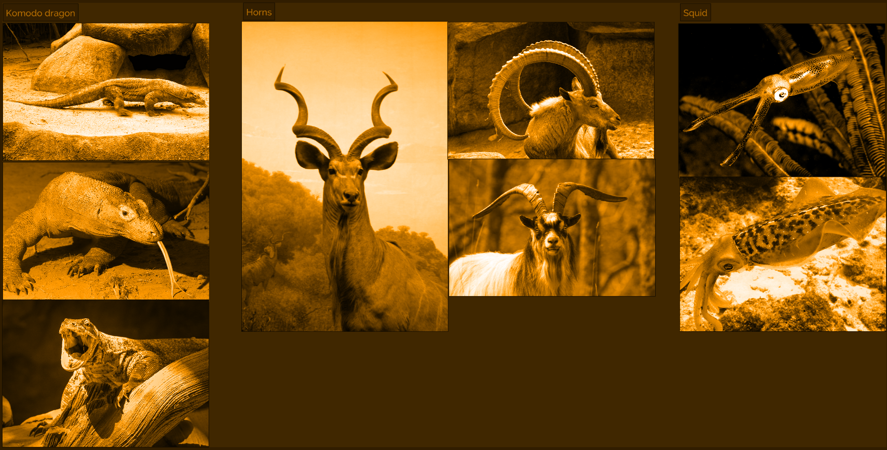

# Demo > Organic

For this demo I chose:

1. Komodo dragon
1. Horns
1. Squid

Download the PureRef file by clicking the image:

## Attribution

| Photo | Info |
| --- | --- |
| Komodo dragon |
|  | <a href="https://flic.kr/p/wTfqoG">Molly Lockhart</a>, <a href="https://creativecommons.org/licenses/by/2.0">CC BY 2.0</a>, via Flickr |
|  | <a href="https://commons.wikimedia.org/wiki/File:Komodo_dragon_with_tongue.jpg">Mark Dumont</a>, <a href="https://creativecommons.org/licenses/by/2.0">CC BY 2.0</a>, via Wikimedia Commons |
|  | <a href="https://commons.wikimedia.org/wiki/File:Komodo_Dragon,_Singapore_Zoo_(4448712446).jpg">Andy Mitchell from Glasgow, UK</a>, <a href="https://creativecommons.org/licenses/by-sa/2.0">CC BY-SA 2.0</a>, via Wikimedia Commons |
| Horns |
|  | <a href="https://flic.kr/p/EVDGx">Dano</a>, <a href="https://creativecommons.org/licenses/by/2.0">CC BY 2.0</a>, via Flickr |
|  | <a href="https://commons.wikimedia.org/wiki/File:Feral_goat.jpg">Einir Pritchard</a>, <a href="https://creativecommons.org/licenses/by/2.0">CC BY 2.0</a>, via Wikimedia Commons |
|  | <a href="https://commons.wikimedia.org/wiki/File:Capra_ibex_ibex_%E2%80%93_01.jpg">Nino Barbieri</a>, <a href="http://creativecommons.org/licenses/by-sa/3.0/">CC BY-SA 3.0</a>, via Wikimedia Commons |
| Kalamar |
|  | <a href="https://commons.wikimedia.org/wiki/File:Sepioteuthis_lessoniana_(Bigfin_reef_squid).jpg">Nhobgood Nick Hobgood</a>, <a href="https://creativecommons.org/licenses/by-sa/3.0">CC BY-SA 3.0</a>, via Wikimedia Commons |
|  | <a href="https://commons.wikimedia.org/wiki/File:Bonaire_Squid.jpg">David Burley - (WT-shared) Khemicals at  wts wikivoyage</a>, <a href="https://creativecommons.org/licenses/by-sa/1.0">CC BY-SA 1.0</a>, via Wikimedia Commons |

{{#include footer.md}}

