# Showcase > Wk.01.02. Organic

Selection:

- Beetles
- Dragonflies
- Plants

Download the PureRef file by clicking the image:

## Attribution

| Photo | Author | License |
| --- | --- | --- |
| Beetles |
| 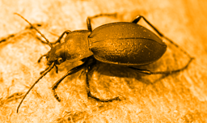 | [Nick Goodrum](https://www.flickr.com/photos/nrgoodrum/29619194667/) | [CC-BY 2.0](https://creativecommons.org/licenses/by/2.0/) |
| 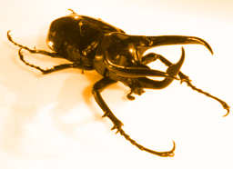 | [Notafly](https://commons.wikimedia.org/wiki/File:Chalcosomaatlas3.JPG) | [CC-BY-SA 3.0](https://creativecommons.org/licenses/by-sa/3.0) |
| 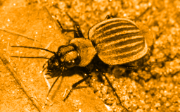 | [Bernard DUPONT from FRANCE](https://commons.wikimedia.org/wiki/File:Velvet_Ground_Beetle_(Graphipterus_galla)_(12639333105).jpg) | [CC-BY-SA 2.0](https://creativecommons.org/licenses/by-sa/2.0) |
| 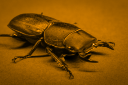 | [Brian Tomlinson](https://www.flickr.com/photos/brian_tomlinson/37392391336) | [CC-BY 2.0](https://creativecommons.org/licenses/by/2.0/) |
| Dragonflies |
| 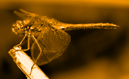 | [André Karwath aka Aka](https://commons.wikimedia.org/wiki/File:Sympetrum_flaveolum_-_side_(aka).jpg) | [CC-BY-SA 2.5](https://creativecommons.org/licenses/by-sa/2.5) |
| 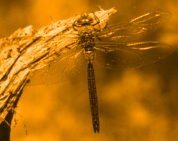 | [G. Švitra](https://commons.wikimedia.org/wiki/File:Anax_parthenope.jpg) | Public Domain |
| 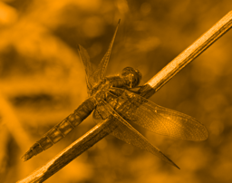 | [Andreas Eichler](https://commons.wikimedia.org/wiki/File:2017.06.18.-11-Viernheim--Feuerlibelle-rotes_Weibchen.jpg) | [CC BY-SA 4.0](https://creativecommons.org/licenses/by-sa/4.0) |
| Plants |
| 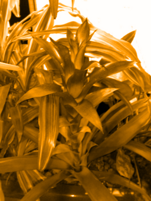 | [Tim Walker](https://www.flickr.com/photos/timjoyfamily/1446480327/) | [CC BY 2.0](https://creativecommons.org/licenses/by/2.0) |
| 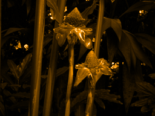 | [Brocken Inaglory](https://commons.wikimedia.org/wiki/File:Tropical_plant_hilo5.jpg) | [CC BY-SA 3.0](https://creativecommons.org/licenses/by-sa/3.0) |
|  | [Justin Lebar](https://commons.wikimedia.org/wiki/File:Heliconia_latispatha_(Starwiz).jpg) | [CC BY-SA 3.0](https://creativecommons.org/licenses/by-sa/3.0) |
| 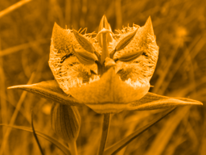 | [Tom Hilton](https://commons.wikimedia.org/wiki/File:Calochortus_tiburonensis_-_Tiburon_Mariposa_Lily_03_(3560215936).jpg) | [CC BY 2.0](https://creativecommons.org/licenses/by/2.0) |
| 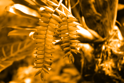 | [Walter from Pinellas Park, Florida](https://commons.wikimedia.org/wiki/File:Exotic_plant_4hw48i.jpg) | [CC BY 2.0](https://creativecommons.org/licenses/by/2.0) |
